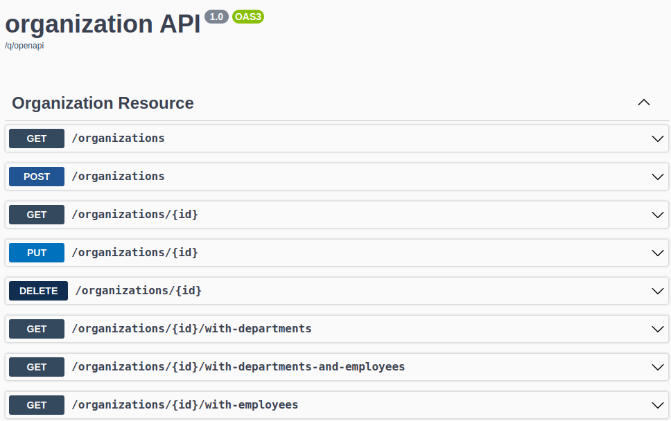

_Repositório apenas para estudo_

# Project 105 - Microserviços Quarkus com Consul Discovery

Demonstração da utilização do Consul Discovery com Microserviços Quarkus.

 

## Arquitetura

Nosso sistema baseado em microsserviços de amostra consiste nos seguintes serviços:

- **employee-service**
  - Serviço contendo o primeiro de nossos microsserviços de amostra que permite realizar o CRUD de funcionários
- **department-service**
  - Serviço contendo o segundo de nossos microsserviços de amostra que permite realizar o CRUD de departamentos.
  - Ele se comunica com _employee-service_.
- **organization-service**
  - Serviço que contém o terceiro de nossos microsserviços de amostra que permite realizar o CRUD de organizações.
  - Ele se comunica com _employee-service_ e _department-service_.
- **discovery-service**
  - Serviço de Descoberta de Seviços utilizando Consul
- **gateway-service**
  - Serviço que usa o Spring Cloud Gateway para executar o aplicativo Spring Boot que atua como um proxy/gateway em nossa arquitetura.

## Endpoits

**employee-api**

**department-api**

**organization-api**

**getwary-api**

O gateway de API está disponível na porta `8080`. Ele usa prefixo `/api`.

Aqui estão alguns endpoints para listar todos os funcionários, departamentos e organizações disponíveis.

- http://localhost:8080/api/employees
- http://localhost:8080/api/departments
- http://localhost:8080/api/organizations

## Referências

- https://piotrminkowski.com/2020/11/24/quarkus-microservices-with-consul-discovery/
- https://quarkiverse.github.io/quarkiverse-docs/quarkus-config-extensions/dev/consul.html
